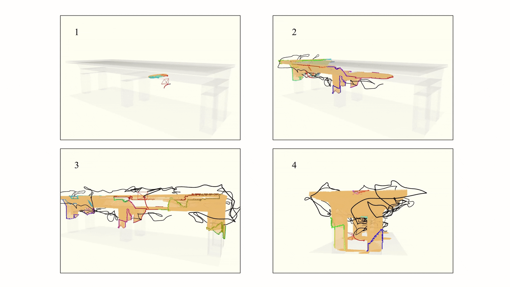
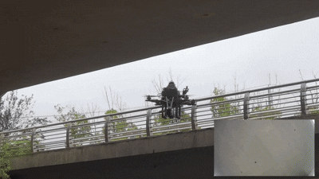
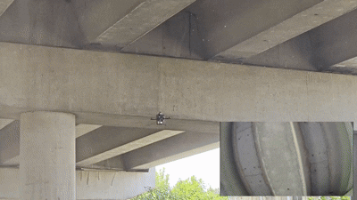

# Online Path Planning for Autonomous Bridge Surface Coverage Using Unmanned Aerial Vehicles

[](http://wiki.ros.org/noetic)
[](https://releases.ubuntu.com/20.04/)
[](https://isocpp.org/)

## 🚀 Overview
*   Unmanned Aerial Vehicles (UAVs) provide a new solution to inspect the bridge and acquire 3D surface data. However, existing studies are difficult to plan an efficient path to achieve high coverage rate and low computation time for complex geometries. 

*   This study proposes an online path planning method for bridge surface coverage using a UAV equipped with a stereo depth camera and a controllable gimbal. 
To address the limitations of fixed-camera approaches in observing horizontal structures, an active gimbal pitch planning is incorporated to maximize coverage. 
Furthermore, a viewpoint evaluation and filtering mechanism is employed to maintain real-time global planning performance by managing the scale of the Traveling Salesman Problem. 
Local path refinement and B-spline trajectory generation are utilized to plan safe, smooth and kinodynamic trajectories. 

*   Results demonstrate that the system achieves a full surface coverage while maintaining a close-range inspection distance. Compared to state-of-the-art methods, it reduces average flight time by 14.1% and computation time by 59.1%. 
This study provides a robust and efficient solution for high-precision bridge inspection in geometrically complex and unknown environments.

The following demo illustrates the autonomous inspection process of a box girder bridge using our proposed online path planner in simulation:

<p align="center">
  
</p>

The proposed planner can be deployed in real-world experiments:

Bridge 1
<p align="center">
  
</p>

Bridge 2
<p align="center">
  
</p>

## 🌟 Key Features
*   An online path planner of UAVs for autonomous bridge surface inspection is proposed to fly near and safely to the structure with complex geometries.
*   Viewpoints target at the bridge surface frontiers are generated by introducing an additional gimbal pitch angle to ensure exploration efficiency and complete coverage.
*   A global path planning method is proposed coupled with viewpoint evaluation and filtering mechanism to achieve satisfactory inspection performance and real-time computation in large-scale scenarios.

## 🔧 Quick Start

This project has been tested on Ubuntu 20.04 (ROS Noetic).

Firstly, you should install __nlopt v2.7.1__:
```
git clone -b v2.7.1 https://github.com/stevengj/nlopt.git
cd nlopt
mkdir build
cd build
cmake ..
make
sudo make install
```

Next, you can run the following commands to install other required tools:
```
sudo apt install libarmadillo-dev
```

Clone the package:

```
git clone https://github.com/ZhuozhiXiong/Bridge-Inspector.git
```

To simulate the depth camera, we use a simulator based on CUDA Toolkit. Please install it first following the [instruction of CUDA](https://developer.nvidia.com/zh-cn/cuda-toolkit). 

After successful installation, in the **local_sensing** package in **uav_simulator**, remember to change the 'arch' and 'code' flags in CMakelist.txt according to your graphics card devices.

If you cannot get access to CUDA, you can use the CPU version instead by revising **set(ENABLE_CUDA false)** in CMakelist.txt.

Then simply compile the package:

```
cd Bridge-Inspector
catkin_make
```

After compilation you can start a sample inspection demo: 

```
source devel/setup.bash
roslaunch exploration_manager run_in_sim.launch
```

By default you can see an bridge environment. Trigger the quadrotor to start inspection by the ```2D Nav Goal``` tool in ```Rviz```. The FoV and trajectories of the quadrotor are displayed.

## 📄 Citation

This work is accepted by ITSC 2026. If you find this work useful in your research, please cite our paper:

```bibtex
@inproceedings{xiong2026bridge-inspector,
  title={Online Path Planning for Autonomous Bridge Surface Coverage Using Unmanned Aerial Vehicles},
  author={Xiong, Zhuozhi and Luo, Xingjian and Hou, Yuxuan and Chen, Xu and Liu, Yunjie and Wang, Hao*},
  booktitle={2026 IEEE 29th International Conference on Intelligent Transportation Systems (ITSC)},
  year={2026},
  organization={IEEE},
  note={accept}
}
```

## 🙏 Acknowledgements

We would like to express our gratitude to the authors of the following open-source projects, which laid the foundation for this work:

* [**FUEL**](https://github.com/HKUST-Aerial-Robotics/FUEL): Fast UAV Exploration using Incremental Frontier Structure and Hierarchical Planning.
* [**Fast-Planner**](https://github.com/HKUST-Aerial-Robotics/Fast-Planner): A Robust and Efficient Trajectory Planning System for Quadrotors.
* [**LKH-3**](http://akira.ruc.dk/~keld/research/LKH-3/): An Effective Implementation of the Lin-Kernighan Traveling Salesman Heuristic for solving the ATSP.
